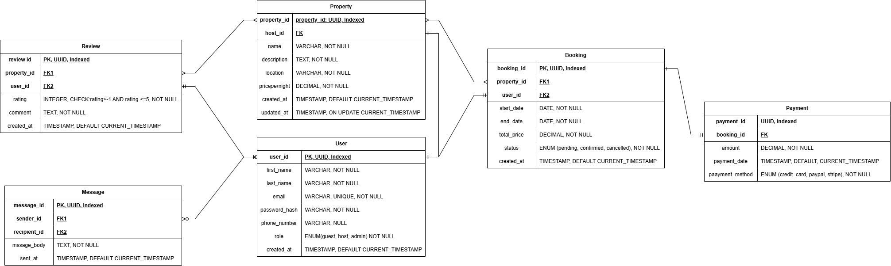

## Entity Relationships

### 1. User ↔ Property
- **One-to-Many:** A User (host) can have many Properties. Each Property belongs to one User (host).
- **Foreign Key:** `Property.host_id` → `User.user_id`

### 2. User ↔ Booking
- **One-to-Many:** A User (guest) can make many Bookings. Each Booking is made by one User.
- **Foreign Key:** `Booking.user_id` → `User.user_id`

### 3. Property ↔ Booking
- **One-to-Many:** A Property can have many Bookings. Each Booking is for one Property.
- **Foreign Key:** `Booking.property_id` → `Property.property_id`

### 4. Booking ↔ Payment
- **One-to-Many:** A Booking can have multiple Payments. Each Payment is for one Booking.
- **Foreign Key:** `Payment.booking_id` → `Booking.booking_id`

### 5. Property ↔ Review
- **One-to-Many:** A Property can have many Reviews. Each Review is for one Property.
- **Foreign Key:** `Review.property_id` → `Property.property_id`

### 6. User ↔ Review
- **One-to-Many:** A User (guest) can write many Reviews. Each Review is written by one User.
- **Foreign Key:** `Review.user_id` → `User.user_id`

### 7. User ↔ Message
- **One-to-Many (Sender), One-to-Many (Recipient):** A User can send many Messages and receive many Messages.
- **Foreign Keys:**  
  - `Message.sender_id` → `User.user_id`  
  - `Message.recipient_id` → `User.user_id`

# Database Normalization Explanation
  
  ## 1. First Normal Form (1NF)
  - **All tables have atomic values:** Each field contains only one value (e.g., no lists or sets).
  - **Each record is unique:** Primary keys are defined for all tables.
  
  ## 2. Second Normal Form (2NF)
  - **All non-key attributes are fully functionally dependent on the primary key:**
    - No partial dependencies exist, as all tables use a single-column primary key (UUID).
    - Example: In the `Booking` table, attributes like `start_date`, `end_date`, and `total_price` depend entirely on `booking_id`.
  
  ## 3. Third Normal Form (3NF)
  - **No transitive dependencies:** All non-key attributes depend only on the primary key, not on other non-key attributes.
    - Example: In the `User` table, `email`, `role`, and `phone_number` all depend only on `user_id`.
    - In the `Property` table, all attributes depend only on `property_id`.
  
  ## Review of Potential Redundancies or Violations
  
  - **No repeating groups or arrays** in any table.
  - **No partial dependencies** since all primary keys are single-column.
  - **No transitive dependencies** detected in the schema.
  - **All foreign keys** are correctly referencing primary keys in other tables.
  
  ## Conclusion
  
  The current schema is in **Third Normal Form (3NF)**.  
  No redundancies or normalization violations were found. No further adjustments are necessary.